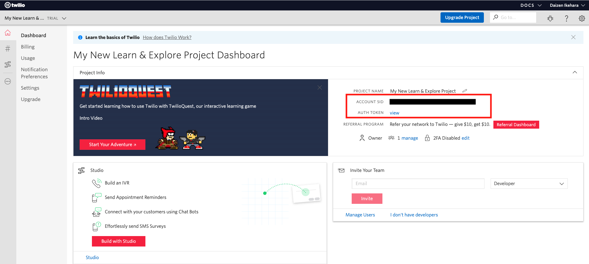

#  手順1: Twilio CLIをインストールし、Twilioアカウントにログインする

この手順では、Twilio CLIを開発マシンにインストールする方法し、アカウントにサインインします。すでにCLIをインストールしている場合は、[手順2: Twilio Serverless Toolkitをインストールする](02-Install-Serverless-toolkit.md)へ進んでください。

## この手順を進めるための前提条件
Twilio CLIをWindows/Macにインストールする場合は、次の環境が必要になります。

- インターネット環境への接続
- [Node.js (10.12以降)](https://nodejs.org/ja/)
- Twilioアカウント（[作成方法](https://www.twilio.com/blog/how-to-create-twilio-account-jp)）

Macの場合は、[Homebrew](https://brew.sh/)を用いてインストールできます。Linuxの場合と併せて下記のドキュメントをご覧ください。
[Twilio CLI Quickstart](https://www.twilio.com/docs/twilio-cli/quickstart)

## 1-1. Twilio CLIのインストール

CLIをインストールするため、シェル（ターミナル）、またはコマンドプロンプトを開き次のコマンドを実行します。

```bash
npm install twilio-cli -g
```

CLIと依存パッケージがインストールされます。完了後、次のコマンドを実行し動作を確認します。

```
twilio
```
実行結果（macOS X、Node.js V12.18.2の場合）
```
$ twilio
unleash the power of Twilio from your command prompt

VERSION
  twilio-cli/2.11.0 darwin-x64 node-v12.18.2

USAGE
  $ twilio [COMMAND]

COMMANDS
  api            advanced access to all of the Twilio APIs
  autocomplete   display autocomplete installation instructions
  debugger       Show a list of log events generated for the account
  email          sends emails to single or multiple recipients using Twilio
                 SendGrid
  feedback       provide feedback to the CLI team
  help           display help for twilio
  login          create a new profile to store Twilio Account credentials and
                 configuration
  phone-numbers  manage Twilio phone numbers
  plugins        list available plugins for installation
  profiles       manage credentials for Twilio profiles
```

## 1-2. TwilioアカウントをCLIに登録

Twilio CLIはTwilioアカウントへの接続情報（`AccountSid`, `AuthToken`）を使用しAPIキーを作成します。プロファイルを作成した後は、このキーが各種APIの呼び出しに用いられます。

これらの情報はコンソールから確認できます。
[Twilioホームページ](https://www.twilio.com/)をブラウザーで開き、[LOG IN](https://www.twilio.com/login) をクリックするか、[コンソール](https://www.twilio.com/console)に直接移動します。



この画面に表示されている`ACCOUNT SID`と`AUTH TOKEN`を控えます。

続けて次のコマンドを実行し、アカウント情報をCLIに登録します。事前に登録が済んでいる場合はスキップいただいてかまいません。

```
twilio login
```

最初に`Account Sid`を入力するように求められます。

```
You can find your Account SID and Auth Token at https://www.twilio.com/console
 » Your Auth Token will be used once to create an API Key for future CLI access to your Twilio Account or Subaccount, and then forgotten.
? The Account SID for your Twilio Account or Subaccount: //ここにAccount Sidを入力
```

続けて、`Auth Token`の入力を求められます。画面上には入力文字が表示されません。ご注意ください。

```
? Your Twilio Auth Token for your Twilio Account or Subaccount: [hidden] //ここにAuth Tokenを入力
```

最後にプロファイル名の入力を求められます。Twilio CLIでは複数のアカウント情報を登録し、切り替えることができます。ここでは任意の名前をつけてください。

```
? Shorthand identifier for your profile: //任意のプロファイル名を入力
```
入力された情報をもとにAPIキーが作成され、キーの情報とプロファイルの保存場所が表示されます。特にこの情報を控える必要はありません。

```
Created API Key SKxxxxxxxxxxxxxxxxx and stored the secret in your keychain. See: https://www.twilio.com/console/runtime/api-keys/SKxxxxxxxxxxxxxxx
twilio-cli configuration saved to "/Users/xxxxxxx/.twilio-cli/config.json"
Saved twilio-cli-handson.
```

## 関連リソース

- [Twilio CLI Quickstart](https://www.twilio.com/docs/twilio-cli/quickstart)


## 次の手順
[手順2: Twilio Serverless Toolkitをインストールする](./02-Install-Serverless-toolkit.md)
