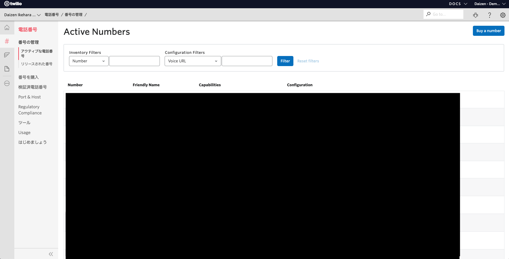
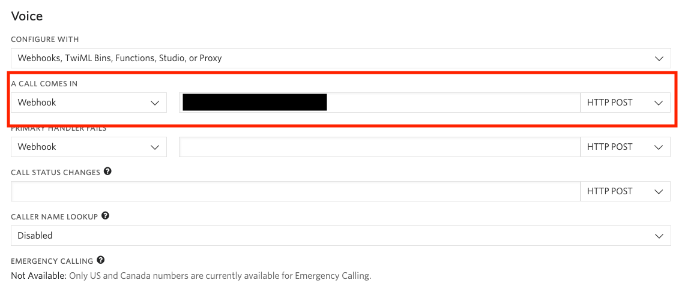

# 手順2: ローカル環境でデバッグを開始する

この手順ではローカルに作成したプロジェクトを開始し、デバッグする方法を学習します。すでに購入済みのTwilio電話番号に着信した際、このアプリケーションに対してリクエストが送信されるように設定します。

## 2-1. ngrokを使ったトンネリング
Webアプリケーションが実行されている場合はいったん停止し、次のコマンドで再度起動します。`--ngrok`オプションを利用すると、[ngrok](https://ngrok.com/)を用いてローカルホストを外部からアクセスできます。セキュリティ上、この類のツールを利用できない場合はこの手順全体をスキップし、次のハンズオンに進んでください。

```
twilio serverless:start --ngrok=""
```
出力から`Twilio functions available:`というラベルを探し、`https://xxxxxxx.ngrok.io/never-gonna-give-you-up` (xxxxxxxは環境によって異なる)というURLを控えてください。

次に[Twilioコンソール - アクティブな電話番号](https://jp.twilio.com/console/phone-numbers/incoming)から購入した電話番号の詳細設定画面を開きます。



着信時（`A CALL COMES IN`）の設定として、`Webhook`を選択し、先ほどのURLを指定します。



`Save`ボタンをクリックし、設定を保存したのちこの電話番号に電話をかけてください。いかがでしょうか。曲が再生されたでしょうか。米国番号の場合は国際コールとなる曲を一曲すべてを聞く必要はありません。

このようにTwilio Serverless Toolkitを利用しローカル開発環境でデバッグができます。

## 次の手順

[Functionを追加](03-Add-Function.md)