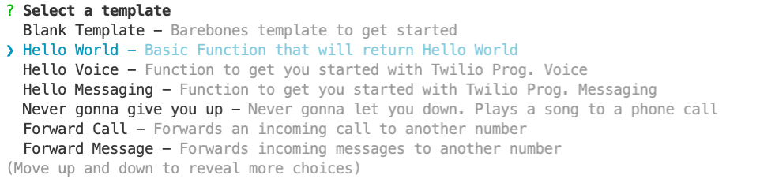
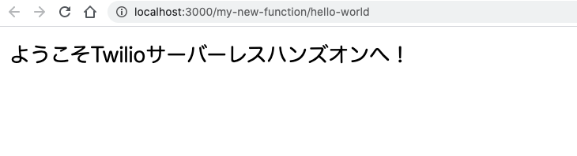

# 手順3: Functionを追加

この手順ではプロジェクトに新しいFunctionを追加する方法と、アクセス権限、環境変数について学習します。

## 3-1. Functionを追加
プロジェクトにFunctionを追加する場合、`twilio serverless:new`コマンドを利用します。次のコマンドを実行してください。

```
twilio serverless:new /my-new-function
```

テンプレートの一覧が表示されます。今回は`Hello World`テンプレートを選択します。



テンプレートを選択すると`functions/my-new-function/hello-world.js`が生成されます。

ここでFunctionのアクセス権限を`protected`とするため`hello-world.js`を`hello-world.protected.js`と変更します。

## 3-1. 環境変数を追加し、Functionで利用

`.env`ファイルを開き、次の変数を追加します。

```
TWILIO_HANDSON_NAME=Twilioサーバーレスハンズオン
```

`hello-world.protected.js`を開き、メッセージを次のように変更します。

```js
exports.handler = function(context, event, callback) {
  const message = `ようこそ${context.TWILIO_HANDSON_NAME}へ！`
  callback(null, message);
};
```

再度アプリケーションを実行し、[http://localhost:3000/my-new-function/hello-world](http://localhost:3000/my-new-function/hello-world)を開いて環境変数が読み込まれていることを確認してください。



アクセス制限についてはデプロイ後に確認します。
このようにTwilio Serverless Toolkitを利用しアプリケーションに必要なFunctionを追加できます。次のハンズオンではこのローカルアプリケーションを __Twilio FunctionsおよびAssets__ にデプロイします。


## 次のハンズオン

[Twilio Functions & Assetsのデプロイ](../03-Deploy-to-Twilio-Cloud/00-Overview.md)