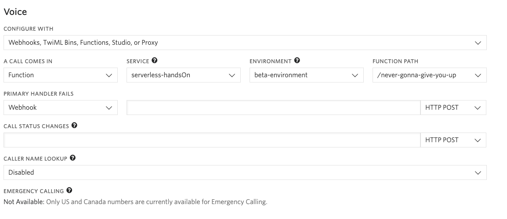

# 手順1: プロジェクトのデプロイとコンソールの設定

この手順では作成したプロジェクトをTwilioのサーバレス実行環境にデプロイする方法を学習します。

## 1-1. プロジェクトをデプロイ

次のコマンドを実行し、ビルドの作成、およびデプロイを開始します。

```
twilio serverless:deploy
```

ビルドおよびデプロイが進行するごとに次のようなログが出力されます。（一部表示を変更しています）

```
Account         SKb*****************************
Token           YdTk****************************
Service Name    serverless-handsOn
Environment     dev
Root Directory  /******/labs-projects/serverless-handsOn
Dependencies
Env Variables   TWILIO_HANDSON_NAME

✔ Serverless project successfully deployed

Deployment Details
Domain: *****-dev.twil.io
Service:
   serverless-handsOn (ZS*****************************)
Environment:
   dev (ZE*****************************) 
Build SID:
   ZB*****************************
View Live Logs:
   https://www.twilio.com/console/assets/api/ZS*****************************/environment/ZE*****************************
Functions:
   [protected] https://*****-dev.twil.io/my-new-function/hello-world
   https://*****-dev.twil.io/never-gonna-give-you-up
Assets:

```

ブラウザで `Functions:`に表示されているURLを開いてみましょう。`never-gonna-give-you-up`は表示できますが、`my-new-function`は表示できないことを確認してください。

```
   [protected] https://*****-dev.twil.io/my-new-function/hello-world
   https://*****-dev.twil.io/never-gonna-give-you-up
```

[Twilio コンソール](https://jp.twilio.com/console/phone-numbers/incoming)から購入済みの電話番号を選択し再度電話番号の設定を変更します。



 `Save`ボタンをクリックし、変更を反映し再度同じ電話番号にかけてみましょう。流れてくる内容は変わりませんが、Twilioにホスティングしているロジックが実行されます。

Twilio上にホスティングされていることを確かめる場合は`/functions/never-gonna-give-you-up.js`の実装を下記のように変更し再度デプロイします。

```js
exports.handler = function(context, event, callback) {
  const twiml = new Twilio.twiml.VoiceResponse();
  const message = `ようこそ${context.TWILIO_HANDSON_NAME}へ！一曲お聞きください。`;
  twiml.say(message, {language: 'ja-JP'});
  twiml.play('https://demo.twilio.com/docs/classic.mp3');
  callback(null, twiml);
};
```

流れてくる音声が変わったことを確認できます。


## 次の手順

[デプロイ環境の切り替え](02-Create-and-Activate-Environment.md)