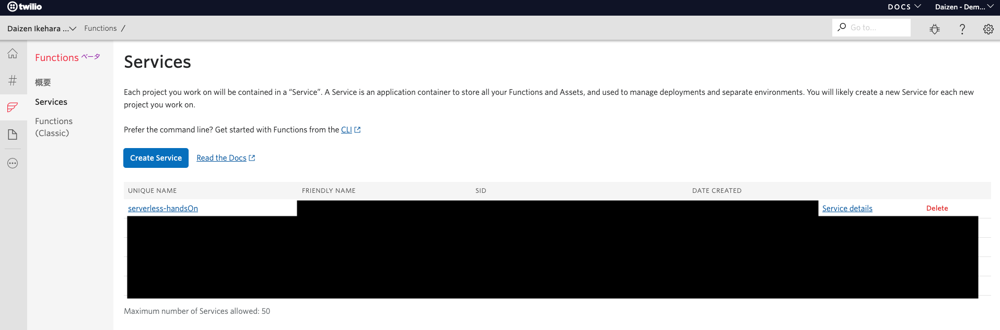

# 手順1: 不要なサービスの削除

この手順ではCLI、コンソール双方で不要なサービスを削除する方法を学習します。どちらかを選択し試してください。

## 1-1. CLIを使ってサービスを削除

Serverless Toolkitでは削除コマンドが提供されていないため、APIを利用する必要があります。まずは現在使っているサービスの一覧を取得しましょう。

```
twilio serverless:list
```

出力からサービス一覧を確認できます。ここで`SID`を控えておきます。

```
Account      SK******************************
Token        Yd******************************
Service      ZS******************************
Environment  dev

Services:

serverless-handsOn
│ SID:      ZS****************************
│ Created:  Oct xx 2020 09:44:57 GMT+0900
│ Updated:  Oct xx 2020 09:44:57 GMT+0900
```

この`SID`とAPIを利用しサービスを削除します。次のコマンドを実行すると`serverless-handsOn`が削除されます。

```
twilio api:serverless:v1:services:remove --sid=ZS****************************
```

## 1-2. コンソールからサービスを削除

[Twilioコンソール](https://jp.twilio.com/console/functions/overview/services)で削除する場合は、Functionsのサービス一覧から`Delete`リンクをクリックします。



